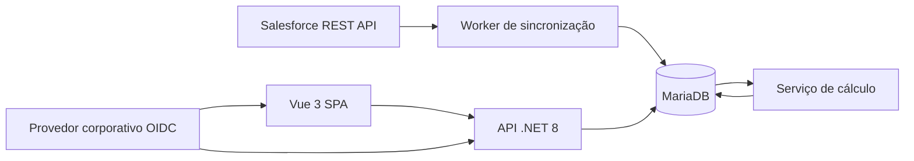

# Plano de desenvolvimento — Score de Atrito Operacional

## 1. Objetivo e recorte

Construir uma aplicação web auditável para identificar atrito operacional por grupo econômico, explicar os fatores do score e orientar ações. O produto é um radar operacional, não uma previsão determinística de churn.

O primeiro release deve entregar sincronização Salesforce, cálculo rastreável, ranking, filtros e detalhe básico. Calibragem administrável e simulação entram após a estabilização dos dados e das fórmulas.

## 2. Decisões técnicas

- Frontend: Vue 3, Vite, TypeScript, Pinia, Vue Router, TanStack Query e biblioteca de componentes a escolher.
- API: .NET 8 ASP.NET Core, OpenAPI, autenticação corporativa via OIDC/OAuth 2.0 e autorização por papéis.
- Worker: .NET 8 Worker Service, compartilhando domínio e infraestrutura com a API.
- Persistência: MariaDB 11.4, Entity Framework Core e migrations versionadas.
- Observabilidade: logs estruturados, health checks, métricas de sincronização e correlation ID.
- Empacotamento: imagens Docker multi-stage, Docker Compose local e artefatos imutáveis por versão.

Recomendação: manter API e Worker no mesmo monorepo e na mesma solution, mas em processos/containers separados. Isso reduz duplicação sem misturar ciclo HTTP com jobs longos.

## 3. Arquitetura alvo



Princípios:

- O frontend não calcula score nem agregações pesadas.
- Dados brutos normalizados, agregados, snapshots e versão da regra são persistidos separadamente.
- Toda pontuação deve ser explicável pelos valores, thresholds e versão usados.
- A sincronização deve ser idempotente e incremental por `SystemModstamp` ou `LastModifiedDate`.

## 4. Estrutura inicial do repositório

```text
HealthScore/
  apps/
    web/                         # Vue 3 + TypeScript
  src/
    HealthScore.Api/
    HealthScore.Worker/
    HealthScore.Domain/
    HealthScore.Application/
    HealthScore.Infrastructure/
  tests/
    HealthScore.UnitTests/
    HealthScore.IntegrationTests/
    HealthScore.ArchitectureTests/
  infra/
    mariadb/
    docker/
  docs/
  docker-compose.yml
  docker-compose.prod.yml
  .env.example
```

## 5. Integração com Salesforce

### Padrão encontrado nos projetos de referência

Os projetos existentes usam OAuth 2.0 `client_credentials`, endpoint `/services/oauth2/token`, Salesforce REST API `v63.0`, consultas SOQL em `/services/data/v63.0/query` e paginação por `nextRecordsUrl`. O projeto `Curadoria I.A` possui credenciais locais configuradas para `https://suportelinx.my.salesforce.com`.

Para o HealthScore:

- reutilizar a mesma Connected App apenas se o administrador confirmar acesso de leitura a `Account`, `Case` e campos relacionados;
- criar um `.env` próprio, ignorado pelo Git, com `SALESFORCE_LOGIN_URL`, `SALESFORCE_CLIENT_ID`, `SALESFORCE_CLIENT_SECRET` e `SALESFORCE_API_VERSION`;
- não copiar segredos para código, Compose, documentação, logs ou histórico Git;
- em produção, injetar os valores pelo secret manager da plataforma;
- tratar `401` com uma única renovação de token e repetir a requisição;
- tratar `429`/`5xx` com backoff exponencial e jitter;
- registrar limites retornados pelo Salesforce e duração/volume de cada execução.

### Estratégia de sincronização

1. Carga inicial de `Account`, paginada.
2. Upsert por Salesforce Id e materialização de grupo/CNPJ.
3. Carga inicial de `Case` por janelas de data para limitar volume.
4. Incrementais por watermark de `SystemModstamp`, com sobreposição curta para tolerar atrasos.
5. Upsert idempotente e avanço do watermark apenas após transação concluída.
6. Reconciliação diária dos últimos 7 dias e reconciliação completa sob demanda.
7. Dead-letter persistida para registros inválidos, sem bloquear todo o lote.

Antes da implementação das queries finais, executar `describe` de `Account` e `Case` para mapear os nomes reais. `SlaViolado__c`, `Fcr__c` e `IssueCodeJira__c` são placeholders no documento.

## 6. Modelo de dados proposto

Tabelas principais:

- `accounts`: uma linha por Account; Salesforce Id, CNPJ normalizado, nome, marca, grupo, ativo e timestamps de origem.
- `economic_groups`: chave interna estável, nome normalizado e quantidade materializada de lojas ativas distintas.
- `cases`: uma linha por Case; conta, datas, status, prioridade, flags, JIRA, produto, vertical, escopo, taxonomia e TMS.
- `business_calendar`: data, competência e indicador de dia útil. Deve suportar feriados relevantes à operação.
- `group_period_metrics`: métricas agregadas por grupo, período e dimensões-base.
- `score_snapshots`: score total, faixa, motivo principal, pontos por fator, versão da regra e momento do cálculo.
- `score_rule_versions`: versão imutável, status rascunho/publicada/arquivada, autor, justificativa e vigência.
- `score_factor_rules`: fator, peso, direção e thresholds ordenados.
- `sync_runs` e `sync_watermarks`: auditoria, volumes, erros e checkpoints.
- `action_plans`: ação sugerida, responsável, status, comentários e histórico.

Restrições importantes:

- CNPJ armazenado normalizado; índice único condicionado à regra de duplicidade definida.
- `lojas_grupo` deriva de contas ativas, nunca dos chamados.
- nomes de grupo precisam de chave estável; texto livre não deve ser a chave primária.
- snapshots referenciam obrigatoriamente uma versão publicada da regra.

## 7. Motor de score

Fatores e pesos iniciais:

| Fator | Peso máximo |
|---|---:|
| Densidade vs. média | 25 |
| Crescimento recente | 15 |
| SLA violado | 15 |
| FCR baixo | 10 |
| Criticidade | 15 |
| Issue/JIRA | 10 |
| Recorrência | 10 |

Regras centrais:

- `densidade = chamados / (lojas_ativas_distintas × dias_uteis)`;
- benchmark = média simples da densidade dos grupos com chamados no mesmo recorte;
- o filtro de grupo não deve reduzir o universo usado pelo benchmark;
- `crescimento = chamados_30d / (chamados_90d / 3) - 1`;
- recorrência = novo chamado do mesmo grupo e tema dentro de 30 dias; o primeiro evento da sequência não conta;
- score = soma dos pontos, limitado a 100;
- desempate do principal motivo: Issue, SLA, Criticidade, Recorrência, Densidade, Crescimento, FCR;
- faixas: Baixo 0–29, Atenção 30–49, Alto 50–69, Crítico 70–100.

Cada snapshot deve guardar métricas de entrada e pontos individuais. Isso permite explicar e reproduzir o resultado mesmo depois de uma alteração de configuração.

### Pontos que exigem ajuste antes de codificar

- A tabela do documento dá 10 pontos tanto para recorrência `<=20%` quanto `>20%`; confirmar se a faixa intermediária deveria valer menos.
- Definir o resultado de crescimento quando a média de 90 dias for zero.
- Confirmar se “últimos 90 dias” inclui os últimos 30 ou usa os 3 meses anteriores.
- Confirmar calendário e feriados usados nos dias úteis.
- Definir se grupos sem chamados aparecem com score zero no ranking.

## 8. Contratos de API

Prefixo recomendado: `/api/v1`.

- `GET /risk-score/summary`: cards executivos.
- `GET /risk-score/groups`: ranking paginado, ordenável e filtrável.
- `GET /risk-score/groups/{groupId}`: resumo e decomposição.
- `GET /risk-score/groups/{groupId}/evolution`: série mensal.
- `GET /risk-score/groups/{groupId}/accounts`: detalhe das contas.
- `GET /risk-score/groups/{groupId}/taxonomy`: ofensores e recorrência.
- `GET /score-config/versions`: histórico de versões.
- `POST /score-config/simulations`: simulação sem publicação.
- `POST /score-config/versions`: cria rascunho.
- `POST /score-config/versions/{id}/publish`: publica com justificativa.
- `POST /jobs/recalculate`: reprocessamento autorizado.
- `GET /jobs/{id}`: progresso e erros.

Usar IDs internos nas rotas, não nomes de grupo. Listagens devem ter paginação, limites máximos e allowlist explícita para ordenação. Exportações grandes devem ser jobs assíncronos.

## 9. Frontend

### Rotas

- `/dashboard`: cards, filtros e ranking.
- `/groups/:id`: diagnóstico, score, evolução, ofensores, contas e ação.
- `/calibration`: versões, edição, simulação e publicação.
- `/jobs`: visibilidade operacional para administradores.

### Estado e comportamento

- filtros serializados na URL para compartilhamento e reprodução;
- requisições e cache com TanStack Query; Pinia apenas para sessão e estado global real;
- tabela com paginação no servidor;
- decomposição sempre em pontos absolutos e valor medido;
- rótulo “Score do Grupo” ao exibir linhas de lojas;
- acessibilidade por teclado e paleta que não dependa apenas de cores.

## 10. Segurança e permissões

Papéis mínimos:

- `Viewer`: consulta dashboard e detalhes.
- `Operator`: gerencia ações e solicita reprocessamentos permitidos.
- `ScoreAdmin`: cria, simula e publica regras.
- `SystemAdmin`: integrações, jobs e diagnósticos.

Controles:

- API valida JWT, issuer, audience e scopes; o frontend não é fronteira de segurança.
- alteração/publicação de regra requer justificativa e auditoria append-only.
- segredos somente em variáveis injetadas/secret manager.
- dados de CNPJ e comentários devem seguir política de retenção e acesso.
- logs não devem conter tokens, payloads completos ou dados pessoais desnecessários.

## 11. Docker, deploy e rollback

Containers:

- `web`: build Vite servido por Nginx/Caddy.
- `api`: ASP.NET Core não privilegiado.
- `worker`: mesma release da API, comando separado.
- `db`: MariaDB apenas no ambiente local; produção deve preferir serviço gerenciado quando disponível.

Requisitos operacionais:

- imagens multi-stage, usuário não root, health/readiness checks e tags imutáveis;
- Compose local com volume persistente e migrations executadas por job único;
- migration backward-compatible antes do rollout da aplicação;
- rollback de aplicação por tag anterior; migration destrutiva nunca no mesmo deploy;
- backup e teste de restauração antes de mudanças destrutivas;
- zero credenciais com valor real no `docker-compose.yml`.

## 12. Estratégia de testes

- Unitários: fórmulas, limites, inversão de FCR, desempates, divisões por zero e recorrência.
- Golden cases: exemplo FELIZ FARMA deve produzir `104 / (36 × 20) = 0,1444`.
- Integração: MariaDB real via Testcontainers; migrations, queries e concorrência de jobs.
- Contrato Salesforce: respostas gravadas/sanitizadas, paginação, token expirado, limites e campos nulos.
- API: autorização por papel, filtros, benchmark imune ao filtro de grupo e paginação.
- Frontend: componentes críticos e fluxos com Vitest; E2E com Playwright.
- Regressão: conjunto congelado comparando resultados do Power BI e do novo motor antes do go-live.

## 13. Status de implementação em 2026-07-08

Concluído:

- monorepo, Docker Compose, API .NET 8, Worker, Vue 3 e MariaDB;
- autenticação Salesforce, carga inicial, sincronização incremental, watermarks e auditoria de execuções;
- motor de score, snapshots móveis e mensais, ranking, resumo, drill-down e planos de ação;
- calibragem com simulação, publicação versionada e recálculo;
- autenticação OIDC/JWT, PKCE no frontend, autorização por papéis e auditoria pelo usuário autenticado;
- filtros de marca, produto, escopo/vertical e Issue/JIRA com recálculo do benchmark e exportação;
- identidade real de grupos por união de conta pai e raiz de CNPJ validado, com rastreabilidade do grupo originalmente reportado;
- cache dos recortes analíticos, índices de consulta e testes unitários do motor, filtros e segurança.

Parcial:

- ingestão não trata ainda exclusões, saída da vertical, dead-letter ou Bulk API;
- thresholds e janelas ainda não são integralmente configuráveis;
- OIDC está implementado, mas depende da homologação com o provedor e grupos corporativos oficiais;
- cobertura automatizada ainda não inclui MariaDB real, Salesforce simulado, endpoints e testes E2E.

Pendente:

- baseline e regressão automática contra o Power BI;
- comparação visual entre versões de regra;
- CI/CD, homologação, registry, secret manager, TLS, backup, restore, observabilidade externa e rollback testado.

## 14. Fases e critérios de saída

### Fase 0 — Descoberta e contrato de dados

- executar `describe` e amostras de `Account`/`Case`;
- mapear campos Power BI → Salesforce;
- decidir grupos nulos, contas ativas, deduplicação, calendário e recorrência;
- criar dataset sanitizado de referência.

Saída: dicionário de dados aprovado e casos de teste esperados.

### Fase 1 — Fundação e ingestão

- monorepo, Compose, CI, migrations, autenticação Salesforce e worker;
- carga de Account/Case, watermark, upsert, auditoria e reconciliação.

Saída: sincronização repetível, idempotente e observável.

### Fase 2 — MVP de score e ranking

- dimensões, calendário, métricas, regras versionadas e snapshots;
- API de summary/ranking e dashboard com filtros.

Saída: paridade acordada com amostra do Power BI e ranking funcional.

### Fase 3 — Diagnóstico e ação

- evolução, contas, taxonomia, recorrência e planos de ação.

Saída: usuário identifica causa e registra acompanhamento.

### Fase 4 — Calibragem governada

- rascunho, simulação, comparação, publicação e reprocessamento.

Saída: mudança de regra auditável sem alteração de código.

### Fase 5 — Produção

- carga, segurança, restore, observabilidade, runbooks e rollout gradual.

Saída: SLOs aprovados, rollback testado e operação treinada.

## 15. Backlog inicial priorizado

1. [x] Mapear os campos utilizados de `Account` e `Case` e validar consultas no Salesforce.
2. [ ] Fechar as decisões pendentes de fórmula e qualidade de dados.
3. [x] Criar solution .NET, aplicação Vue e Docker Compose.
4. [x] Implementar autenticação/configuração segura Salesforce.
5. [x] Criar schema e migrations de integração/auditoria.
6. [x] Implementar sincronização incremental de contas e chamados.
7. [x] Materializar grupos e calendário base.
8. [ ] Implementar motor de score puro — parcial; falta regressão contra o Power BI.
9. [x] Criar snapshots e endpoints de ranking/summary.
10. [x] Construir dashboard e filtros analíticos.
11. [x] Implementar drill-down, recorrência e ações.
12. [ ] Implementar calibragem, simulação e publicação — parcial; falta comparação visual entre versões.
13. [x] Implementar OIDC/JWT, login/logout, papéis e auditoria autenticada.
14. [ ] Criar testes de integração, contratos Salesforce e testes E2E.
15. [ ] Criar pipeline de entrega, backup, restore, observabilidade e rollback.

## 16. Decisões e configurações ainda necessárias

- Provedor de identidade corporativo e grupos que mapeiam para cada papel.
- confirmar o campo oficial de conta ativa; a deduplicação usa CNPJ válido e raiz de oito dígitos;
- Tratamento de `GrupoEconomico__c` nulo.
- confirmar se haverá um campo corporativo específico de escopo; atualmente o filtro usa a vertical de abertura, pois o `describe` de `Case` não retornou campo de escopo;
- Semântica exata do crescimento de 30/90 dias.
- Calendário de feriados.
- o benchmark filtrado foi definido como a média de densidade dos grupos elegíveis no próprio recorte;
- Política para recalcular histórico após publicar nova regra.
- Meta de atualização e SLOs de página/job.

## 17. Definition of Done transversal

Uma entrega só está concluída quando possui migration reversível ou compatível, testes automatizados, logs e métricas, documentação do contrato, controle de acesso, nenhuma credencial versionada e procedimento de rollback validado.
